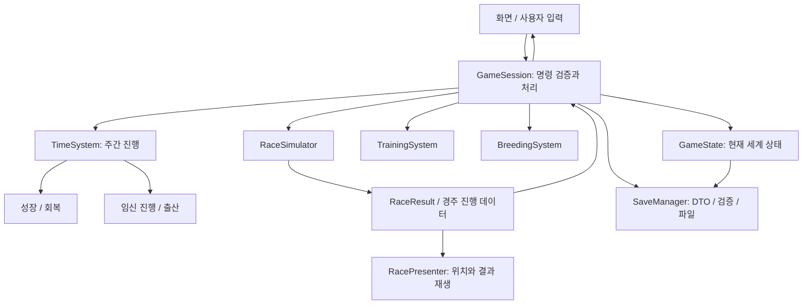

# Horse Legacy — Phase 1 개발 계획

상태: P1-01과 P1-02 구현 완료. 새 게임·말 조회·수동 저장·로드·백업 복구가 실행 가능하다. 다음 작업은 P1-03의 시간 진행이다. 전체 Phase 1 순환은 아직 구현하지 않았다.

## Architecture

목표는 `말 → 훈련 → 경주 → 기록 → 은퇴 → 교배 → 자마 → 경주`의 한 세대 순환이다. Phase 2 이후의 확장은 사용자 승인 후 진행한다.

### 기술 선택

| 후보 | 적합성 | 이번 선택 |
| --- | --- | --- |
| Godot 4 + GDScript | UI, 2D/3D, 파일 저장, headless 테스트를 단일 도구로 지원. 별도 언어 런타임이 불필요하다. | 채택 |
| Godot 4 + C# | 정적 타입과 .NET 테스트 생태계가 강점이나 별도 SDK·배포 경로가 필요하다. | 현재 규모에서는 보류 |
| Unity + C# | 3D 에셋·도구 생태계가 크지만 현재 목표에 비해 편집기·빌드 환경 비용이 크다. | 보류 |

엔진은 현재 클라우드에 설치된 **Godot 4.6.3 Standard**, 언어는 **타입을 명시하는 GDScript**로 정한다. 엔진 업그레이드는 별도 검증 작업으로 진행한다. Phase 1에는 외부 플러그인, 서버, DB, 계정 시스템을 요구하지 않는다.

클라우드에서는 실행 전 `/workspace/horse-legacy-environment/activate.sh`를 source하여 쓰기 가능한 XDG 경로를 적용한다. 실제 프로젝트의 실행·검사 명령은 README.md, 구현 범위와 검증 결과는 DEVLOG.md를 기준으로 확인한다.

제작 순서는 Godot Control 기반 경영 화면과 단순한 경주 위치 표시를 먼저 만드는 방식이다. 경주 표시 방식은 기능 검증을 위한 것으로, 최종 2.5D/3D 미술 방향은 아직 확정하지 않는다. 최종 배포 플랫폼도 별도 결정 사항이다. Linux headless 실행은 클라우드 검증 대상으로 사용한다.

### 계층과 의존 방향

- `domain`: 말·세계 상태·경주 결과. SceneTree나 UI 노드를 참조하지 않는 RefCounted 기반 데이터 객체.
- `systems`: 전달받은 상태와 명시적인 난수 입력으로 훈련·성장·경주·교배를 계산한다.
- `application`: 명령의 가능 여부를 검사하고 상태 변경을 조율한다. GameSession만 현재 게임 상태의 소유자가 된다.
- `presentation`: 사용자 입력을 명령으로 전달하고 상태·결과를 표시한다. 능력치 계산이나 보상 지급을 하지 않는다.
- `persistence`: DTO 변환, 검증, 마이그레이션, 파일 저장·복원을 담당한다.

모든 Manager를 Autoload로 만들지 않는다. GameSession 하나를 앱의 진입점으로 두고, 나머지 시스템은 일반 객체로 구성한다. UI의 signal은 화면 갱신에 사용하며, 핵심 처리 순서는 명시적인 함수 호출로 유지한다.

### 제안 디렉터리

```text
horse-legacy/
  project.godot
  README.md
  DEVLOG.md
  DESIGN_DECISIONS.md
  DEVELOPMENT_PLAN.md
  scenes/
    main.tscn
    screens/                   # 목장·말 상세·훈련·경주·결과·교배·혈통
    components/                # 말 목록 항목·능력치 표시 등
  src/
    domain/                    # Horse, GameState, RaceResult 등
    application/               # GameSession, 명령 처리
    systems/                   # 시간·훈련·경주·교배
    persistence/               # SaveManager, DTO, migration
    presentation/              # 화면 바인딩·경주 재생
  data/
    rules/                     # 승인된 게임 규칙과 조정 수치
    races/                     # Phase 1용 기본 경주 정의
  assets/
  tests/
    unit/
    integration/
    fixtures/
    run_tests.gd
```

위 구조는 설계안이며 빈 디렉터리나 placeholder 구현을 미리 대량 생성하지 않는다.

## Data Model

공통 규칙: 말의 ID는 이름·목록 순번과 무관한 문자열이다. 부모·경주 참가자·소유 목장은 ID로 참조한다. 나이는 저장된 날짜와 생년에서 계산하며 중복 저장하지 않는다. 사망·매각 이후에도 혈통에 필요한 Horse 기록은 보존한다.

| 모델 | 주요 필드 / 책임 |
| --- | --- |
| GameState | schemaVersion, simulationVersion, gameId, currentWeek, nextId, rngState, playerFarmId, horsesById, farmsById, raceResults, history |
| Horse | id, name, sex, birthWeek, fatherId?, motherId?, breederFarmId, ownerFarmId, lifeStage, careerStatus, stats, potential, growthType, condition, career |
| StatBlock | Speed, Stamina, Acceleration, Power, Spirit, Intelligence의 고정 6개 값 |
| Condition | fitness, fatigue, stress, injury의 상태와 남은 회복 기간 |
| Career | starts, wins, earnings, raceResultIds. 원본 결과와 일치해야 한다. |
| Farm | id, name, horseIds, money, reputation. 시설·직원은 Phase 3에서 추가한다. |
| TrainingPlan | horseId, trainingType. 기간·비용·증가량은 승인된 규칙에서 읽는다. |
| RaceDefinition | id, name, distance, entryConditions, entrantLimit, rewards. Phase 1에는 기본 경주만 제공한다. |
| RaceEntry | horseId와 경주 시작 시점의 참가 상태 스냅샷 |
| RaceProgress | tick, phase, 각 말의 거리·속도·잔여 stamina·완주 여부. 실행 중 임시 데이터다. |
| RaceResult | id, week, seed, simulationVersion, entrySnapshots, finishOrder, finishTimes, rewardsApplied |
| Pregnancy | id, sireId, damId, conceivedWeek, dueWeek, conceptionSeed, status |
| HistoryEvent | id, week, type, 관련 ID, 당시 이름 등 표시용 스냅샷. Phase 1의 출생·경주·은퇴 기록부터 시작한다. |

Horse는 경주 경력 상태(`unraced / active / retired`)와 생애 단계(`foal / adult / deceased`)를 구분한다. 번식 가능 여부는 나이·성별·은퇴·건강·임신 상태에서 계산한다. 경주 은퇴가 즉시 노쇠나 사망을 뜻하지 않는다. Phase 1에서 사망 규칙은 구현하지 않고, 이후에도 기록이 유지될 구조만 확보한다.

ID 발급은 GameState의 저장되는 카운터를 사용해 세계 내부에서 유일하게 만든다. 서로 다른 세이브 간 말 교환은 범위 밖이다. RNG 상태와 seed 같은 64비트 값은 JSON 정밀도 손실을 피하도록 문자열로 직렬화한다.

도구 검사에서 Godot JSON 파싱 후 정수 필드의 타입 복원이 필요함을 확인했다. 실제 DTO 로더는 숫자의 정수 여부와 범위를 먼저 검증한 뒤 명시적으로 int로 복원한다. 단순 캐스팅으로 잘못된 소수나 문자열을 정상 데이터처럼 받아들이지 않는다.

### 혈통과 유전

- 부모 링크를 통해 최소 5대를 탐색할 수 있도록 설계한다. P1-01의 String 필드에서 알 수 없는 창시마 부모는 빈 문자열로 표현한다.
- 동일한 조상이 여러 가지에 나타나는 것은 정상이다. 현재 탐색 경로의 순환만 오류로 구별하고 깊이 제한을 둔다.
- 자마의 현재 능력과 잠재 능력을 분리한다. 부모의 훈련 직후 수치만 평균내어 자마를 만들지 않는다.
- Phase 1 유전식은 능력별 부모 잠재력의 가중 기여 + 제한된 변이 + 성장 타입을 사용하도록 설계한다. 구체적인 가중치·분산·최솟값·최댓값은 규칙 결정 후 고정한다.
- Traits의 실제 유전 효과와 인브리딩 보너스·페널티는 확장 단계다. 승인된 추천안에 따라 초기 버전에서는 가까운 혈연 교배를 금지한다.

### 세이브 경계

`user://saves/`에 버전 있는 JSON을 저장한다. 임시 파일 쓰기 → flush/close → 다시 읽어 스키마·참조 무결성 확인 → 기존 유효본을 백업 → 같은 디렉터리에서 교체한다. 각 단계의 실패를 검사하고 실패 시 마지막 유효본을 유지한다. rename의 전원 장애 내구성을 과장하지 않으며 대상 OS에서 복구를 검증한다.

로드는 임시 GameState에 대해 버전, 타입, 범위, ID 중복, 부모 참조, 혈통 순환, 결과 참조를 검증한 뒤 한 번에 적용한다. 손상 파일로 현재 진행 상태를 덮어쓰지 않는다. 미래 버전 세이브는 명확히 거부하며, 실제 스키마 변경 시 순차 마이그레이션과 이전 버전 fixture를 함께 추가한다.

P1-02는 현재 모델에 대한 schema_version 1을 구현했다. `SaveSchema`가 검증하고 `SaveCodec`이 DTO와 객체를 변환하며 `SaveManager`가 파일을 관리한다. 경주·임신·AI 목장은 아직 미구현이므로 해당 기록은 이후 스키마 확장 대상이다. 현재 형식은 존재하지 않는 경주 결과 참조를 받아들이지 않는다. 저장 규칙은 docs/SAVE_FORMAT.md에 기록한다.

경주 계산은 UI 애니메이션과 분리한다. 시뮬레이션이 끝나면 기록·상금을 한 번 적용하고 결과 화면을 재생한다. 다시 재생하거나 로드해도 중복 적용하지 않는다. 승인된 추천안에 따라 재생 중 저장을 로드하면 계산된 결과를 보존하고 결과 화면으로 복귀한다.

## Scene / UI Structure

`Main → TitleScreen → GameShell`을 기본 경로로 둔다. GameShell은 날짜, 자금, 저장 상태를 표시하고 다음 화면으로 이동한다.

| 화면 | Phase 1 사용자 동작 / 표시 |
| --- | --- |
| TitleScreen | 새 게임, 계속하기, 저장 파일 오류 안내 |
| RanchScreen | 보유 말, 주간 진행, 최근 출생·경주·은퇴 기록 |
| HorseDetailScreen | 이름, 성별, 나이, 상태, 6개 능력치, 컨디션, 부모, 전적, 은퇴 |
| TrainingScreen | 훈련·휴식 선택, 적용 결과와 피로 변화 |
| RaceEntryScreen | 참가 가능한 말과 경주 조건, 출전 확인 |
| RaceScreen | 각 말의 위치, 진행 거리, 순위, 남은 거리, 실제 데이터에 따른 이벤트 |
| RaceResultScreen | 착순, 기록, 보상, 경력 반영 결과 |
| BreedingScreen | 부모 후보, 교배 불가 사유, 임신·출산 진행 |
| PedigreeScreen | 최소 5대 탐색, 조상 선택 시 상세 조회, 모르는 조상 표시 |
| SaveLoadDialog | 저장·로드 결과, 백업 복구, 덮어쓰기 확인 |

목록·상세·기록을 연결해 ‘이 말의 부모가 어떤 경주를 뛰었는가’를 확인할 수 있게 한다. 최종 미술, 복잡한 카메라, 경매장, 직원·시설 화면은 이 단계에 포함하지 않는다.

## Core Systems



1. **GameSession**: 새 게임, 훈련, 주간 진행, 출전, 은퇴, 교배 명령을 검증한다. 검증 실패 시 자금·날짜·상태를 변경하지 않는다.
2. **TimeSystem**: 1주를 단위로 날짜와 성장·회복·임신을 일관된 순서로 갱신한다. 버튼 중복 입력으로 한 주가 두 번 처리되지 않게 한다. 승인된 추천안에 따라 말마다 주간 훈련 또는 경주를 선택하고 미배정 시 휴식한다.
3. **TrainingSystem**: 선택한 메뉴에 따라 능력·컨디션을 바꾸고 잠재 상한을 지킨다. 휴식의 효과와 과훈련 위험을 검증한다.
4. **RaceSimulator**: START / EARLY / MIDDLE / FINAL TURN / FINAL STRAIGHT / FINISH를 고정 시간 간격으로 계산한다. 능력, 가속, 간단한 stamina 소비, 피로·건강, 제한된 난수가 실제 구간 속도에 영향을 준다. 결승선 통과 시점을 보간해 착순을 정한다. 렌더 프레임률은 결과를 바꾸지 않는다.
5. **Career 처리**: 결과 ID로 경력·보상을 한 번만 반영한다. 은퇴한 말은 참가 검증에서 거부하되 기존 기록을 유지한다.
6. **BreedingSystem**: 두 부모의 유효성과 번식 조건을 검사하고 Pregnancy를 만든다. 출산 시 고유 ID, 양쪽 부모 ID, 유전 능력과 성장 정보를 가진 자마를 정확히 한 번 등록한다.
7. **SaveManager**: 저장 상태의 유일한 파일 입출력 경계다. UI는 파일을 직접 읽거나 쓰지 않는다.

Phase 1에서도 경주가 난수 하나의 비교가 되지 않도록 구간 이동과 기본 stamina를 구현한다. Phase 2는 거리·마장 적성, 선택 가능한 페이스·주법, 기수, Trait 효과, 고급 중계와 애니메이션을 추가하는 단계로 구분한다. 기획의 Phase 2 기능을 승인 없이 선행 개발하지 않는다.

## Phase 1 Task Breakdown

| 순서 | 작업 단위 | 완료 조건 |
| --- | --- | --- |
| P1-01 | 최소 Godot 프로젝트, GameState/Horse, 새 게임 | 실행 시 여러 말 생성, ID 유일성·초기 상태 검증, 창작 규칙의 승인 항목 반영 |
| P1-02 | 세이브/로드 기반과 테스트 실행기 | 별도 프로세스에서 저장→종료→로드, 상태 일치, 손상 파일 복원 거부·유효본 보존 |
| P1-03 | 말 목록·상세·주간 진행 | 화면 선택과 데이터 일치, 나이·성장·회복 갱신, 중복 진행 방지 |
| P1-04 | 훈련·휴식 | 4개 훈련과 휴식이 능력·피로에 반영, 상한과 불가 조건 검증 |
| P1-05 | 경주 계산과 기록 | 여러 참가마가 구간을 이동해 완주, 동일 입력·seed 재현, 결과·보상 1회 적용 |
| P1-06 | 경주 진입·시각화·결과 UI | 위치·거리·순위·결승 결과 일치, 재생 속도가 결과에 영향 없음 |
| P1-07 | 은퇴·교배·출산 | 은퇴 후 출전 불가, 부모 선택 검증, 출산 시 중복 없이 자마 등록 |
| P1-08 | 성장·5대 혈통 조회·자마 출전 | 시간 진행으로 출전 조건 충족, 부모·조상 조회, 자마의 경주 결과 생성 |
| P1-09 | 전체 세대 통합 검증·사용 안내 | 사용자 시나리오 전체 통과, 별도 프로세스 로드 후 계속 진행, DEVLOG 갱신 |

각 작업은 기능 구현, 해당 기능의 실패 조건 테스트, 직접 실행, 문서 기록까지 포함한다. 자동 테스트는 Godot headless 실행기가 실패 시 0이 아닌 종료 코드를 반환하고 실행 개수를 보고하도록 만든다. GUT 등 외부 테스트 프레임워크 도입은 현재 필수로 두지 않는다.

### 필수 통합 시나리오

새 게임 → 말 선택 → 훈련 → 경주 → 결과·전적 반영 → 주간 진행 → 수말·암말 은퇴 → 교배 → 출산 → 자마 성장 → 자마 경주 → 저장 → 프로세스 종료 → 별도 프로세스에서 로드 → 다음 주와 다음 활동 정상 진행.

검증은 부모 ID, 자마 ID, 현재 주차, 능력, 경력, 경주 결과, 자금, 임신 상태, 난수 상태가 보존되는지 포함한다. 두 번째 출산이나 두 번째 보상 지급이 발생하지 않는지도 확인한다. headless 검증과 별개로 실제 그래픽 환경에서 클릭 동선·글자·경주 표시를 점검해야 Phase 1 UI 검증을 완료한 것으로 본다.

## Risk

| 위험 | 대응 / 검증 |
| --- | --- |
| 좋은 말을 키워도 선택이 결과에 반영되지 않음 | 동일 seed의 비교 시나리오로 능력·컨디션 변화의 효과 검증, 여러 seed로 경향 확인. 강한 말의 무조건 우승을 보장하는 테스트는 피한다. |
| 교배가 평균 반복으로 수렴하거나 무한히 강해짐 | 잠재력·현재 능력 분리, 제한된 변이와 승인된 상한, 여러 세대의 분포 점검 |
| 나이·임신·회복이 서로 다른 시간을 사용 | 절대 주차 하나를 기준으로 계산, 경계 주차와 재로드 테스트 |
| 조상 삭제나 중복 ID로 혈통 붕괴 | 영구 기록·ID 참조 검증, 알 수 없는 부모와 순환 오류를 구별 |
| 저장 중 종료·파일 손상·스키마 변경 | 임시 파일 검증, 백업, 실패 주입, 버전 fixture, 로드 성공 전 현재 상태 유지 |
| 경주 표시와 착순·보상이 불일치 | 하나의 시뮬레이션 결과에서 재생과 경력 반영, 결승 통과 보간, 중복 반영 방지 |
| RNG 또는 엔진 변경으로 재현성 깨짐 | seed·RNG 상태·simulationVersion 저장. 동일 버전 재현을 보장하고 다른 버전의 완전 동일 결과는 약속하지 않는다. |
| 수십 년의 기록으로 저장 크기 증가 | 영구 결과와 임시 경주 프레임 분리. 무제한 프레임 저장을 피하고 실제 규모를 측정한다. |
| 그래픽 작업이 핵심 순환을 지연 | 기능용 시각화부터 구축. 고급 3D 모델·카메라·음악은 Phase 6의 별도 작업이다. |
| 클라우드 headless 성공을 GUI 성공으로 오인 | 엔진·논리·파일 테스트와 실제 창의 입력·렌더링 검증 결과를 구별한다. |

## Implementation Order

**규칙 결정 → 데이터와 새 게임 → 저장/로드 → 시간과 훈련 → 경주와 기록 → 경주 화면 → 은퇴와 교배 → 출산과 성장 → 혈통과 자마 출전 → 전체 흐름 검증**.

저장/로드는 마지막에 붙이지 않고 첫 데이터 모델부터 만든다. 그래야 은퇴·출산 같은 되돌리기 어려운 상태 변화가 생길 때마다 복원 가능성을 검증할 수 있다. 매 작업은 기존 통합 시나리오를 유지하며 작은 단위로 추가한다.

### 사용자가 승인한 기본 게임 규칙

사용자가 추천안으로 첫 작업 진행을 승인했다. 세부 수치는 해당 시스템 작업에서 구체화한다.

| 항목 | 승인된 방향 |
| --- | --- |
| 세대 진행 속도 | 현실적인 성장·임신 기간 + 여러 주 진행 |
| 주간 행동 규칙 | 말마다 훈련 또는 경주 선택, 미배정 시 휴식 |
| 초기 보유 말 | 경주 가능한 수말·암말 |
| 가까운 혈연 교배 | Phase 1에서 금지 |
| 경주 재생 중 저장 | 계산된 결과를 보존하고 결과 화면으로 복귀 |

승인 내용은 DESIGN_DECISIONS.md의 DECISION-008에 기록했다. 초기 콘텐츠 수치는 DECISION-009를 참고한다.
